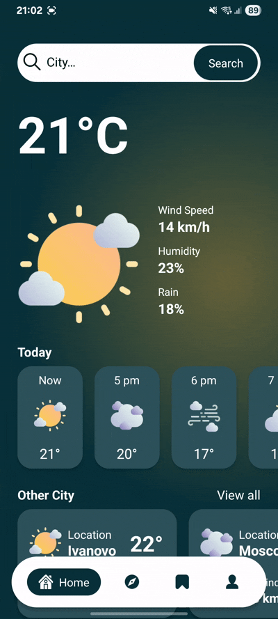
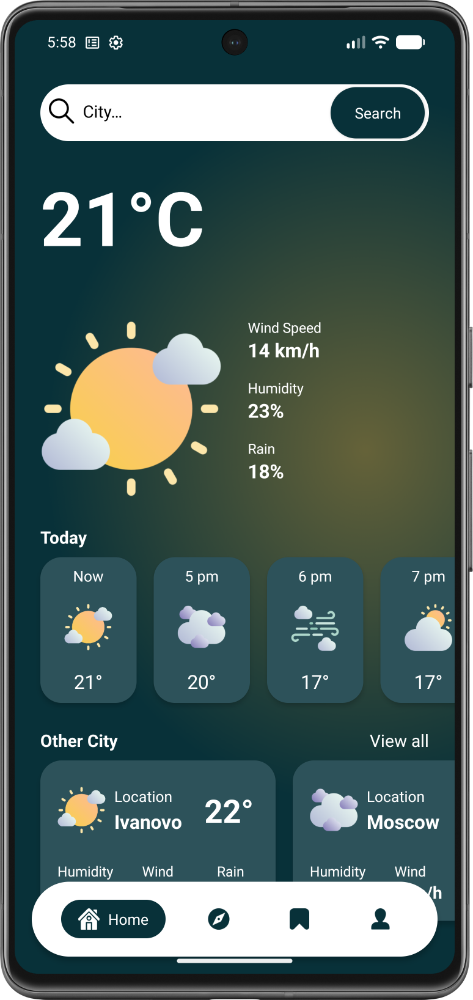
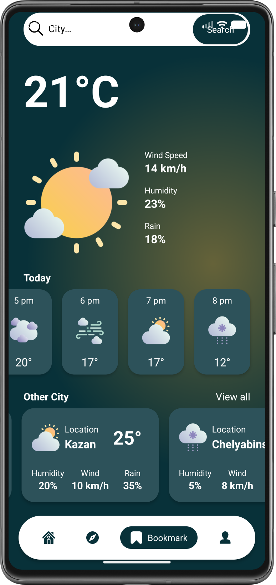

# ☁️ Погода – UI-концепт

Демонстрационный экран текущей погоды с почасовым прогнозом и информацией о других городах.  
Интерфейс построен на классических Android View и RecyclerView, оформлен в современном стиле с нижней панелью навигации.

---

## ✨ Что представлено на экране

- **🔍 Строка поиска** – поле для ввода названия города (имитация поиска, без реальной логики).
- **🌡️ Текущая погода** – температура, состояние (солнечно, облачно), скорость ветра и влажность.
- **⏱️ Почасовой прогноз** – горизонтальный список с погодой на ближайшие часы (температура, иконка, время).
- **🌍 Погода в других городах** – горизонтальный список карточек с названием города, температурой, скоростью ветра и влажностью.
- **📌 Нижняя панель навигации** – `ChipNavigationBar` с иконками. Переключение чипов визуально анимировано, но не ведёт к смене экранов (прототип).

---

## 🛠 Технологический стек

---

## 🎥 Демонстрация

  
   
  <em>Прокрутка почасового прогноза, список городов и взаимодействие с ChipNavigationBar.</em>

---

## 📸 Скриншоты

| Текущая погода | Прогноз в других городах |
| :-------------------: | :-------------------------------: |
|  |  |

---

## 🧱 Особенности реализации

- **Разметка на XML** с использованием `ConstraintLayout` для сложного позиционирования элементов (текущая погода, строка поиска, списки).
- **Два `RecyclerView`**:
  - Горизонтальный – для почасового прогноза (настраиваемый `LinearLayoutManager`).
  - Горизонтальный – для списка городов.
- **Адаптеры** написаны на Kotlin для плавного обновления (даже на статических данных).
- **ChipNavigationBar** – сторонняя библиотека (`com.ismaeldivita.chipnavigation:chip-navigation-bar`), добавлена в зависимости. Настроена смена иконок и цветов при выборе.
- **Данные** – заглушки в виде локальных списков, имитирующих ответ от API.
- **Никаких лишних библиотек** – минимум зависимостей, вся логика в коде.

---

## ⚙️ Элементы интерфейса

| Элемент | Как взаимодействует |
|---------|---------------------|
| **Строка поиска** | Нажмите, чтобы ввести текст. Имитация ввода (без запросов). |
| **Почасовой прогноз** | Горизонтальный `RecyclerView` – свайпайте вправо/влево для просмотра часов. |
| **Список городов** | Горизонтальный `RecyclerView` – свайпайте вправо/влево для просмотра погоды в городах. |
| **ChipNavigationBar** | Нажимайте на чипы «Home», «Explorer», «Bookmark», «Profile» – они анимированно переключаются, но экран остаётся тем же. |

---

## 🚀 Быстрый старт

1. Перейдите в раздел [**Releases**](https://github.com/kerikir/WeatherAppUI/releases).
2. Скачайте APK-файл (`Weather.apk`).
3. **Установка:**
   - Откройте загруженный файл на устройстве Android.
   - При необходимости разрешите установку из неизвестных источников.
   - Следуйте инструкциям на экране.
4. Запустите «Погода», чтобы увидеть демонстрационный экран.

> ℹ️ Данные статические, поиск не работает, нижняя панель только отображается. Приложение создано для демонстрации UI.
